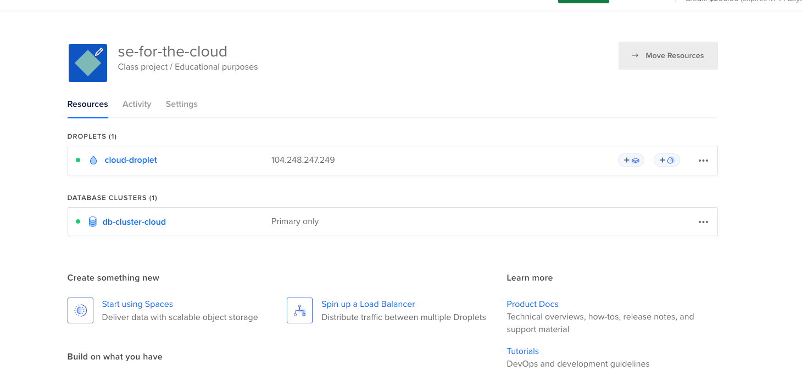
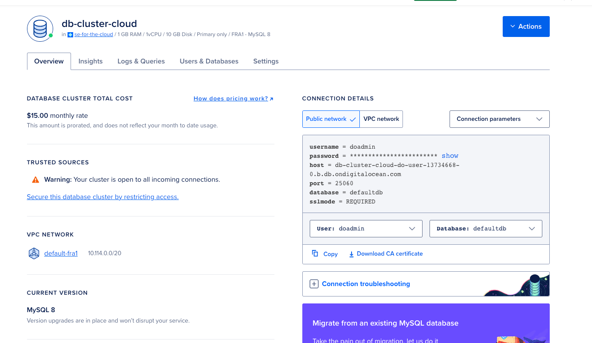
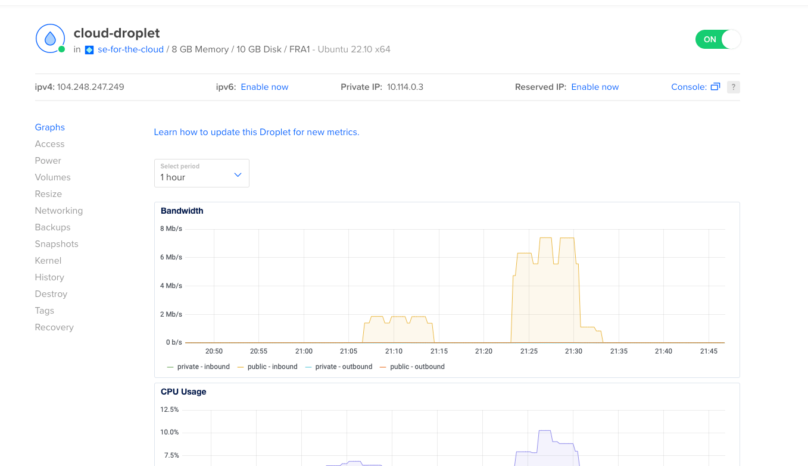
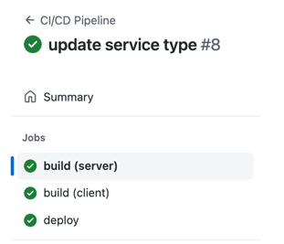
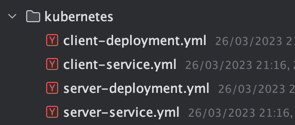
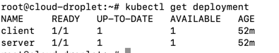
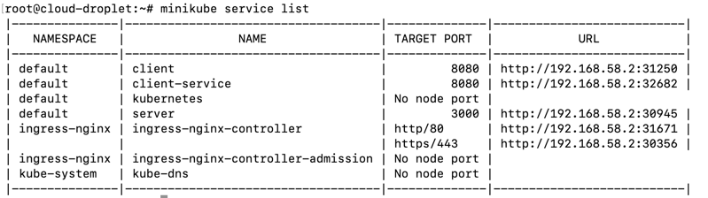
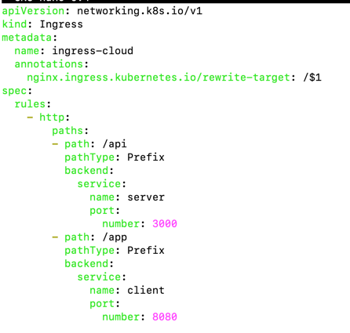
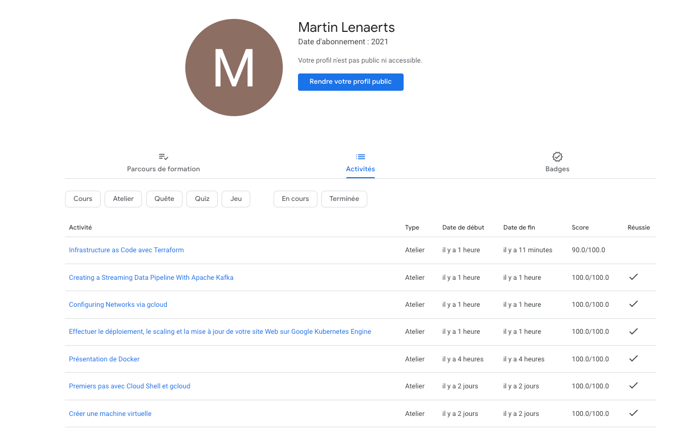
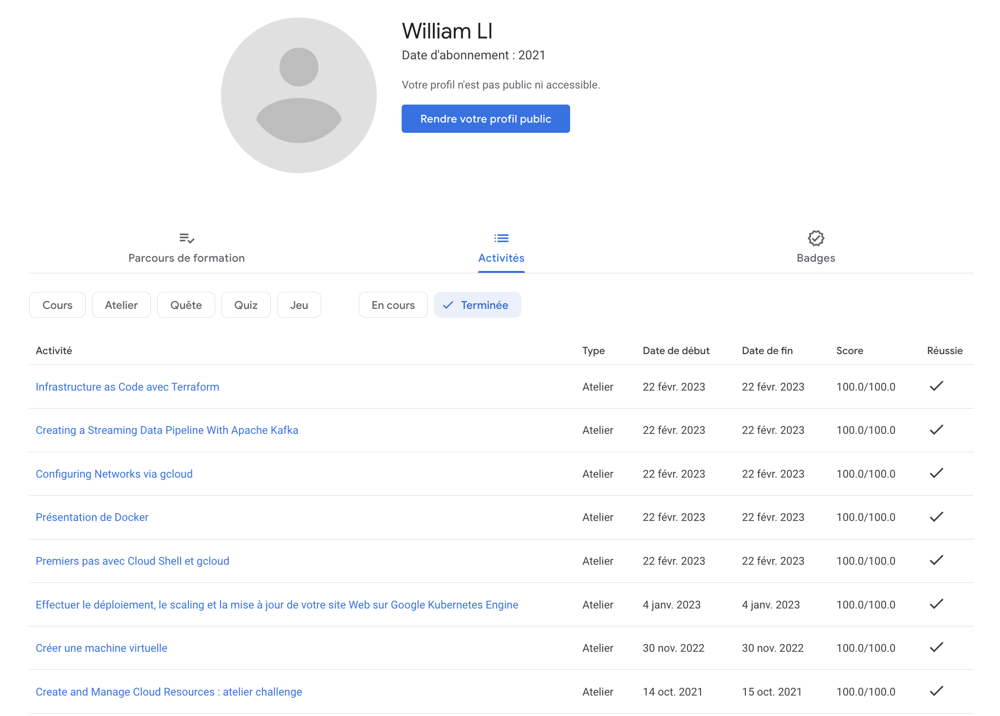

# school-se-for-the-cloud

For the project we used Docker, Kubernetes, Minikube

We use Digital Ocean as cloud infrastructure

We have created a database and a droplet for the deployment

For automatically deploy our app we have created a ci cd pipeline that deploy the services to docker hub
and update the deployment of kubernetes by restarting the pods.

For the k8s config we have created kubernetes YML manifest for our services.

### Deployment

Minikube service list

ingress.yml

---

## Labs

